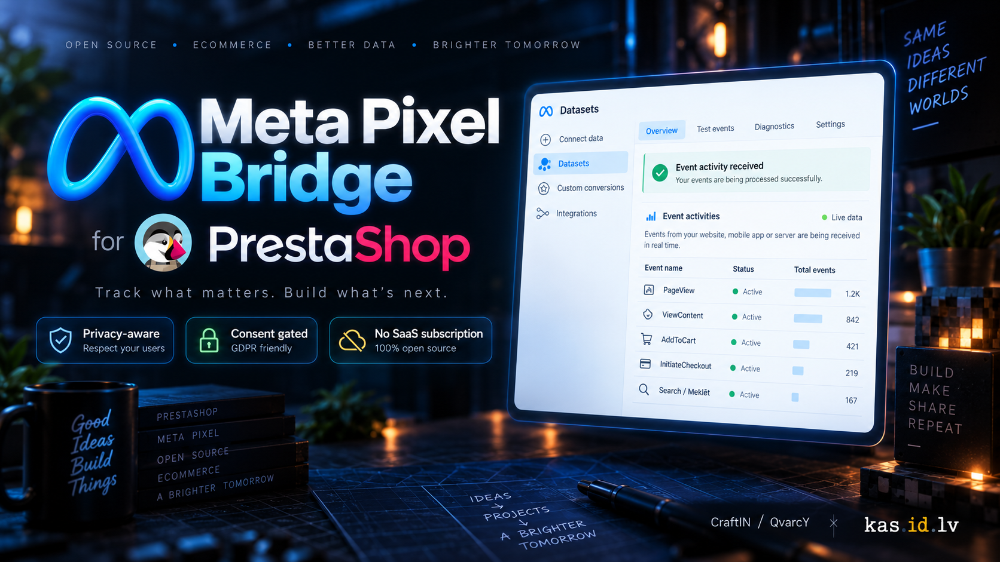
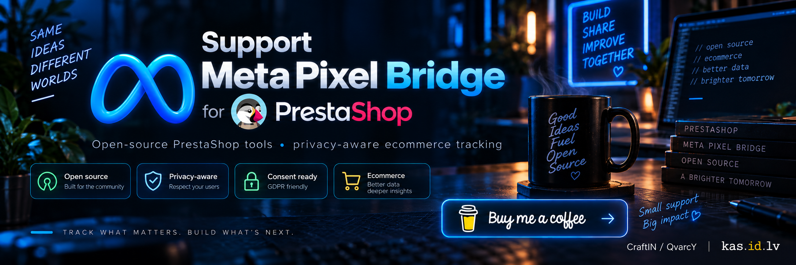

<p align="center">
  
</p>

# Meta Pixel Bridge for PrestaShop

A free, open-source and subscription-free Meta Pixel integration for PrestaShop 8.

Meta Pixel Bridge adds privacy-aware browser-side Meta Pixel tracking to PrestaShop without requiring a paid module, SaaS subscription or external tracking service.

It is designed to remain transparent, configurable and easy to test.

> **Independent project:** Meta Pixel Bridge is not affiliated with, endorsed by, or officially connected to Meta Platforms, Inc. or PrestaShop SA.

---

## Why this module?

Many PrestaShop integrations for Meta tracking are bundled into commercial services, subscriptions or larger marketing platforms.

Meta Pixel Bridge focuses on one job:

**Send useful PrestaShop ecommerce events to Meta Pixel correctly, transparently and only when tracking is allowed.**

- No SaaS account
- No monthly subscription
- No external middleware
- No Advanced Matching in the current release
- No customer PII intentionally sent by the current release

Your store communicates directly with Meta Pixel from the visitor's browser after the configured marketing-consent condition has been satisfied.

---

## Features

### Supported Meta events

| PrestaShop activity | Meta event | Status |
|---|---|---|
| Page visit | `PageView` | ✅ |
| Product page | `ViewContent` | ✅ |
| Product added to cart | `AddToCart` | ✅ |
| Checkout started | `InitiateCheckout` | ✅ |
| Store search | `Search` | ✅ |
| Order confirmation | `Purchase` | ⚠️ Optional / disabled by default |

### Tracking features

- Meta Pixel / Dataset ID configuration
- Strict consent gating
- Cookie-based marketing consent
- LocalStorage JSON consent
- Manual JavaScript consent API
- Optional always-granted mode
- Dry-run testing mode
- Browser console debug logging
- Optional Global Privacy Control / Do Not Track support
- PrestaShop `updateCart` integration for successful AddToCart events
- Product ID, name, price and currency support
- Cart contents and checkout value support
- Search query tracking
- Unique event IDs
- Deterministic Purchase event IDs for future browser/server deduplication
- No Advanced Matching
- No customer email, phone number or other customer PII intentionally sent by this release

---

## Tested

Meta Pixel Bridge v1.0.1 has been tested on:

**PrestaShop 8.2.3**

The following browser events were verified end-to-end using Meta Events Manager:

- `PageView`
- `ViewContent`
- `AddToCart`
- `InitiateCheckout`
- `Search`

The events were successfully:

1. generated by PrestaShop,
2. processed by Meta Pixel Bridge,
3. sent to the Meta Pixel endpoint,
4. returned with a successful HTTP response,
5. displayed as **Processed** in Meta Events Manager.

Example Meta Pixel Bridge event IDs:

```text
mpb_pageview_...
mpb_viewcontent_27_...
mpb_addtocart_27_...
mpb_checkout_101_...
mpb_search_...
```

---

## Installation

### 1. Download the module

Download the latest release ZIP from GitHub Releases.

Example:

```text
metapixelbridge-1.0.1.zip
```

Do not unzip it before uploading it to PrestaShop.

### 2. Install in PrestaShop

Open:

```text
PrestaShop Back Office
→ Modules
→ Module Manager
→ Upload a module
```

Upload the module ZIP file.

After installation, open:

```text
Meta Pixel Bridge
→ Configure
```

For the complete installation guide, see:

[docs/INSTALLATION.md](docs/INSTALLATION.md)

---

## Recommended first-time configuration

Enter your Meta Pixel / Dataset ID.

Example format:

```text
1234567890123456
```

Use your own numeric ID from Meta Events Manager.

For the first test, the recommended configuration is:

```text
Enable tracking             Enabled
Dry-run mode                Enabled
Debug logging               Enabled
Respect GPC / Do Not Track  Enabled

PageView                    Enabled
ViewContent                 Enabled
AddToCart                   Enabled
InitiateCheckout            Enabled
Search                      Enabled
Purchase                    Disabled
```

Keep **Dry-run mode enabled** until you have confirmed that the correct events and values are being generated.

---

## Consent handling

Meta Pixel Bridge can prevent the Meta Pixel script from being requested until marketing consent is granted.

In consent-controlled configurations:

```text
No marketing consent
        ↓
Meta Pixel script is not loaded
        ↓
No Meta browser events are sent
```

After valid marketing consent:

```text
Marketing consent granted
        ↓
Meta Pixel is initialized
        ↓
Configured events are sent
```

### Supported consent sources

Meta Pixel Bridge currently supports:

```text
Marketing-consent cookie
LocalStorage JSON consent
Manual JavaScript API
Always granted
```

For detailed consent configuration, see:

[docs/CONSENT.md](docs/CONSENT.md)

---

## Marketing-consent cookie

The module can read a browser cookie and compare its value against configured accepted values.

Example accepted values:

```text
accepted,marketing,1,true,yes
```

Matching can use:

```text
Exact value
```

or:

```text
Stored value contains one accepted value
```

The actual cookie name and accepted values depend on your own consent solution.

---

## LocalStorage JSON consent

Meta Pixel Bridge can read marketing consent from a JSON object stored in browser LocalStorage.

Example:

```json
{
  "necessary": true,
  "analytics": true,
  "marketing": true,
  "saved_at": 1788795208,
  "valid_until": 1804347208
}
```

Example configuration:

```text
LocalStorage key:
craftin_cookie_consent_v1

Marketing field path:
marketing

Expiry field path:
valid_until
```

The values above are examples only.

Configure them to match your own consent manager.

If an expiry field is configured, expired consent is treated as not granted.

---

## Manual JavaScript consent API

For custom consent managers, Meta Pixel Bridge exposes a small browser API.

Grant consent:

```javascript
MetaPixelBridgeConsent.grant();
```

Revoke consent:

```javascript
MetaPixelBridgeConsent.revoke();
```

Re-check consent:

```javascript
MetaPixelBridgeConsent.refresh();
```

This allows another consent-management solution to control when Meta tracking becomes available.

---

## Always granted mode

This mode assumes consent is handled somewhere else.

Use it only when you understand the privacy implications and your consent requirements are already being handled externally.

It may also be useful temporarily during controlled development testing.

It is not recommended as a general production default.

---

## GPC and Do Not Track

Meta Pixel Bridge can optionally respect browser privacy signals:

```text
Global Privacy Control
Do Not Track
```

Recommended setting:

```text
Respect GPC / Do Not Track:
Enabled
```

When enabled, supported browser privacy signals can prevent tracking even if another configured consent source would otherwise allow it.

---

## Dry-run mode

Dry-run mode allows the full tracking logic to run without sending events to Meta.

Example browser console output:

```text
[MetaPixelBridge] DRY RUN — event not sent to Meta PageView
```

or:

```text
[MetaPixelBridge] DRY RUN — event not sent to Meta ViewContent
```

This allows you to verify:

- product IDs
- event names
- prices
- currency
- cart contents
- checkout value
- search terms
- event IDs

before enabling live tracking.

---

## Testing

A detailed verification guide is available here:

[docs/TESTING.md](docs/TESTING.md)

The recommended testing process is:

```text
1. Enable Dry-run
2. Enable Debug logging
3. Verify consent denied state
4. Verify consent granted state
5. Test PageView
6. Test ViewContent
7. Test AddToCart
8. Test InitiateCheckout
9. Test Search
10. Disable Dry-run
11. Verify browser network requests
12. Verify events in Meta Events Manager
```

---

## Testing with Meta Events Manager

After local testing is successful:

1. Disable **Dry-run mode**.
2. Keep **Debug logging** enabled temporarily.
3. Open Meta Events Manager.
4. Select your Dataset / Pixel.
5. Open **Test Events**.
6. Select **Website**.
7. Enter your store URL.
8. Start the test session.
9. Browse your store and perform test actions.

Expected events:

```text
PageView
ViewContent
AddToCart
InitiateCheckout
Search
```

Each manually generated Meta Pixel Bridge event includes an `eventID`.

---

## Browser network verification

If events appear in the browser console but not in Meta Events Manager, verify the network request directly.

Open:

```text
F12
→ Network
```

Filter for:

```text
facebook.com/tr
```

A working Meta Pixel request should contain your Pixel ID and event name.

Example:

```text
id=YOUR_PIXEL_ID
ev=PageView
```

Other examples:

```text
ev=ViewContent
ev=AddToCart
ev=InitiateCheckout
ev=Search
```

A successful request should return a successful HTTP status.

---

## Purchase event warning

`Purchase` is intentionally disabled by default.

The current browser-side Purchase implementation is triggered from the PrestaShop order-confirmation flow.

That is appropriate only when:

```text
Order confirmed = Purchase completed
```

For delayed payment methods such as:

- bank transfer
- cheque
- manual payment
- offline payment

an order may exist before payment has actually been received.

In that situation:

```text
Order created
≠
Payment received
```

Enabling browser Purchase tracking could therefore report unpaid orders as purchases.

For stores using delayed payment methods, keep:

```text
Purchase = Disabled
```

A future Conversions API implementation is planned to support **paid-only Purchase events** based on PrestaShop order status.

---

## Event IDs and future Conversions API support

Meta Pixel Bridge already generates unique event IDs.

Example browser event:

```text
mpb_pageview_...
```

Purchase uses a deterministic event ID structure designed for future browser/server deduplication.

Example:

```text
mpb_purchase_1_43
```

The intended future architecture is:

```text
Browser Purchase
event_id = mpb_purchase_1_43

Server Purchase
event_id = mpb_purchase_1_43
```

This prepares Meta Pixel Bridge for browser/server event deduplication when Conversions API support is added.

> **Conversions API is not included in v1.0.1.**

---

## Privacy

Meta Pixel Bridge v1.0.1 does not implement Advanced Matching.

The module does not intentionally send customer:

```text
email
phone number
name
postal address
customer account ID
```

to Meta.

The browser-side event payload focuses on ecommerce activity such as:

```text
product IDs
product name
price
currency
cart contents
number of items
search query
```

Store owners remain responsible for configuring the module and their consent solution in accordance with applicable privacy and data-protection requirements.

This project provides technical tools, not legal advice.

---

## Troubleshooting

### Events appear in the browser console but not in Meta

First check:

```text
Dry-run mode = Disabled
```

Then inspect:

```text
F12
→ Network
→ facebook.com/tr
```

Verify:

```text
Pixel ID
Event name
HTTP status
```

---

### Consent is granted but tracking remains blocked

For LocalStorage consent, verify the stored value:

```javascript
localStorage.getItem('YOUR_STORAGE_KEY');
```

and:

```javascript
JSON.parse(localStorage.getItem('YOUR_STORAGE_KEY'));
```

Make sure the configured marketing field represents a granted state.

Example:

```text
marketing = true
```

If an expiry field is configured, make sure the consent has not expired.

---

### Module was updated but old JavaScript still runs

PrestaShop may continue serving a combined cached JavaScript file.

Clear the PrestaShop cache:

```text
Back Office
→ Advanced Parameters
→ Performance
→ Clear cache
```

Then reload the storefront with:

```text
Ctrl + F5
```

Do not edit generated PrestaShop cache JavaScript files directly.

---

## Current release

### v1.0.1

Current browser Pixel release includes:

```text
PageView
ViewContent
AddToCart
InitiateCheckout
Search
Optional browser Purchase
Cookie consent
LocalStorage JSON consent
Manual consent API
Always-granted mode
Dry-run mode
Debug logging
GPC / DNT support
Unique event IDs
```

See:

[CHANGELOG.md](CHANGELOG.md)

for release history.

---

## Roadmap

Future development may include:

- Meta Conversions API
- Paid-only Purchase events
- Browser + server event deduplication
- Additional diagnostics
- Improved consent integrations
- Additional PrestaShop compatibility testing
- Additional ecommerce event support

Roadmap items are not guaranteed and are not part of the current release.

---

## Documentation

Detailed project documentation:

- [Installation guide](docs/INSTALLATION.md)
- [Consent configuration](docs/CONSENT.md)
- [Testing guide](docs/TESTING.md)
- [Changelog](CHANGELOG.md)
- [Contributing](CONTRIBUTING.md)
- [Security policy](SECURITY.md)
- [MIT License](LICENSE.md)

---

## Contributing

Bug fixes, compatibility improvements, documentation improvements and well-reasoned feature proposals are welcome.

Before contributing, please read:

[CONTRIBUTING.md](CONTRIBUTING.md)

Bug reports and feature requests can be submitted using the GitHub issue templates.

For security or privacy vulnerabilities, please do not open a public issue.

See:

[SECURITY.md](SECURITY.md)

---

## Support the project

Meta Pixel Bridge is free and open source.

If this project helps your PrestaShop store, saves you a paid subscription or you would simply like to support continued development, you can buy me a coffee.

<p align="center">
  <a href="https://buymeacoffee.com/craftin">
    
  </a>
</p>

<p align="center">
  <strong>
    <a href="https://buymeacoffee.com/craftin">Support Meta Pixel Bridge on Buy Me a Coffee</a>
  </strong>
</p>

---

## Author

**CraftIN / QvarcY (kas.id.lv)**

Developer website:

https://kas.id.lv/

CraftIN:

https://craftin.lv/

GitHub:

https://github.com/QvarcY

Contact:

info@craftin.lv

CraftIN and QvarcY / kas.id.lv represent the same independent developer and creator behind this project.

---

## License

Meta Pixel Bridge is released under the MIT License.

See:

[LICENSE.md](LICENSE.md)

Copyright © 2026 CraftIN / QvarcY (kas.id.lv)

---

## Trademarks

Meta, Facebook and Meta Pixel are trademarks or registered trademarks of Meta Platforms, Inc.

PrestaShop is a trademark or registered trademark of PrestaShop SA.

Use of these names in this project is solely for compatibility, identification and documentation purposes.

This project is independent and is not affiliated with, sponsored by, endorsed by, or officially connected to Meta Platforms, Inc. or PrestaShop SA.